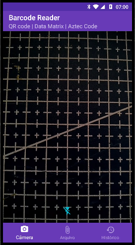
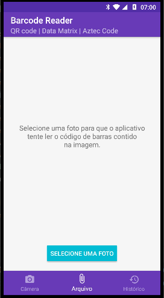
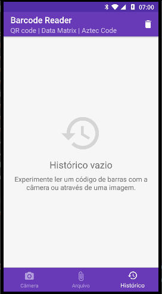

# Barcode Reader 
O aplicativo foi construido para leitura de código de barras. Inicialmente a leitura de códigos 2D (QR Code, Data Matrix, Aztec Code) 

O diferencial deste app é a possibilidade de leitura por imagens já salvas no dispositivo e manter um histórico de leituras realizadas.

#### Telas
| CameraFragment  | FileFragment| HistoryFragment | 
| ------------- | ------------- | ----- | 
|  |  |  |

## Finalidade
- [x] **Estudo**: Este projeto foi criado para fins de aprendizado e prática.
- [ ] **Curso**: Este projeto é parte de um curso específico.
- [x] **Projeto Real**: Este projeto é uma aplicação real a ser publicada.

### Estudo
- Utilizar a api de leitor de código de barras do Google Play service;
- Navegar nos arquivos internos do smartphone;
- Utilizando plugins de `checkstyle`;
- Numero da versão baseado nos commit do GitHub, através de uma função no Gradle; 
- Design de layout;

### Publicação
Um MVP chegou a ser publicado na [Play Store](https://play.google.com/store/apps/dev?id=6194829043303383594). 

## Outras Considerações
**Site:** Proposta era contruir um site no próprio GitHub IO, para gerar QR Codes de forma simples: https://fbvictorhugo.github.io/barcode-app/

**Construção paralizada:** Emeados de 2017
